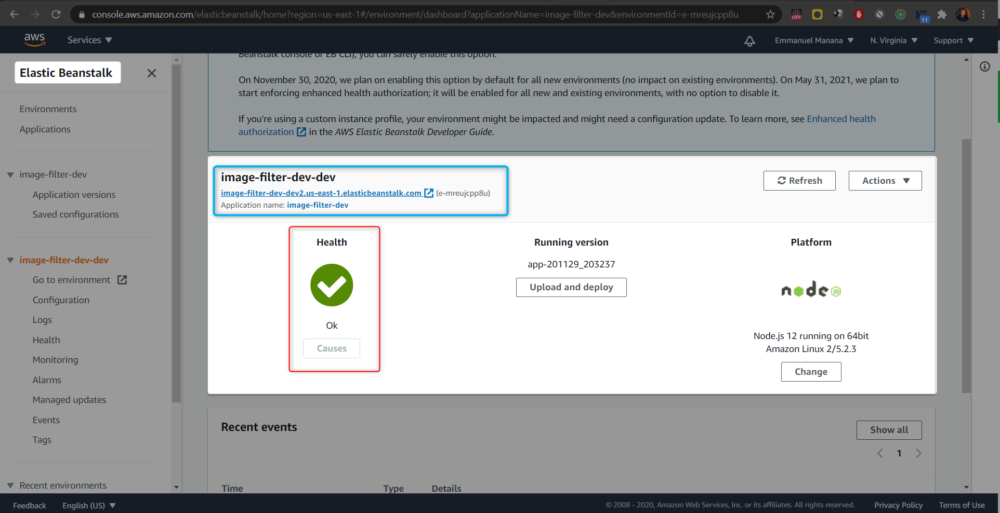

<h1>Image-Filter-Endpoint: </h1>

<h3>An endpoint URL for an elastic beanstalk deployment (EB_URL):</h3>

<a href = "http://image-filter-dev-dev2.us-east-1.elasticbeanstalk.com/" target = "_blank">,<= click here> </a>

<a href = "https://avatars1.githubusercontent.com/u/50702567?s=460&u=e24d87c8578fb47b0f1c1174b66b487577e5c1e9&v=4" target = "_blank">,[ click here to test it ]</a>

<h3></h3>

